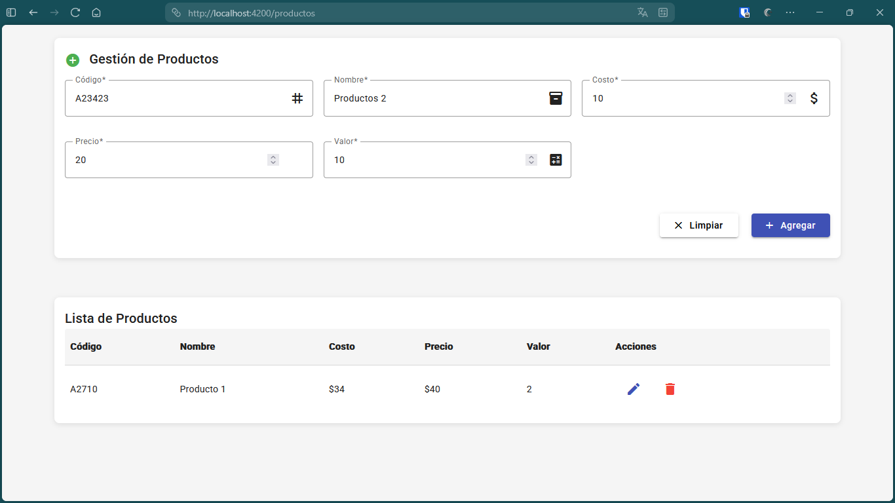
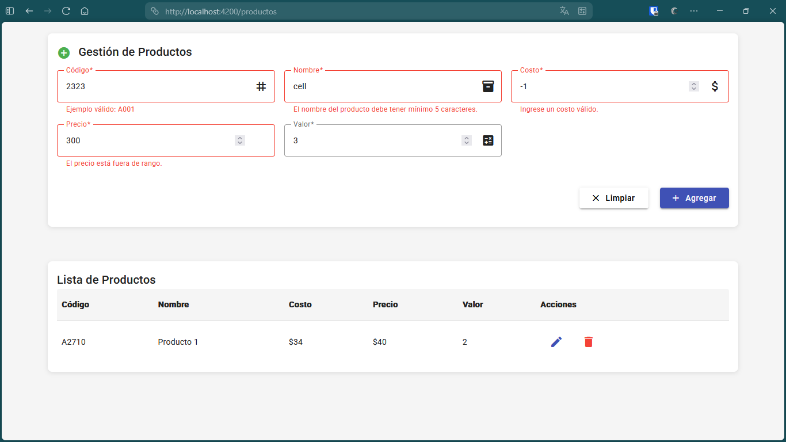
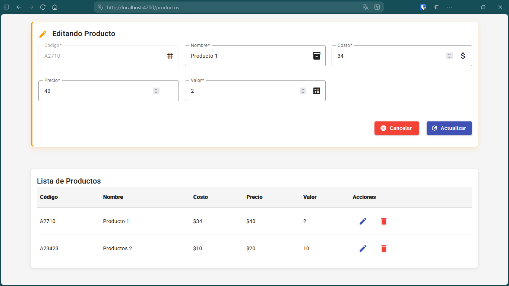
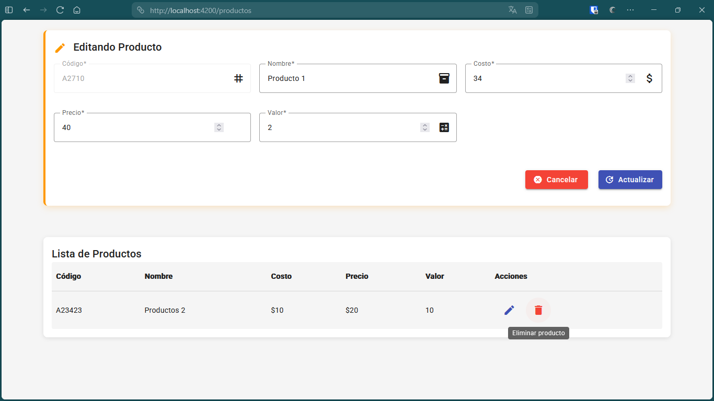

# spa-lab (Angular 17)

## 📋 Resultados de la Práctica

### ✨ Implementación del Módulo de Productos con Angular Material 17

Esta práctica implementa un **sistema completo de gestión de productos** utilizando Angular 17 con Material Design, que incluye las siguientes funcionalidades:

#### 🎯 Características Principales

1. **Formulario Reactivo con Validaciones**
   - Campos: Código, Nombre, Costo, Precio, Valor
   - Validaciones en tiempo real con mensajes de error personalizados
   - Iconos descriptivos para cada campo
   - Diseño responsivo con Material Design

2. **Tabla de Datos Interactiva**
   - Visualización en tabla Material con datos formateados
   - Acciones de editar y eliminar con iconos intuitivos
   - Tooltips informativos en los botones

3. **Estados de Operación**
   - **Modo Agregar**: Formulario limpio para nuevos productos
   - **Modo Editar**: Carga datos existentes con indicadores visuales
   - **Confirmación de Cancelación**: Previene pérdida de datos no guardados

#### 🖼️ Capturas de Pantalla

##### Ingreso de Datos

*Formulario con Angular Material para ingreso de nuevos productos*

##### Validación de Datos

*Sistema de validación en tiempo real con mensajes de error*

##### Modo Edición

*Interfaz de edición con indicadores visuales y botones de acción*

##### Funcionalidad de Eliminación

*Tabla interactiva con opciones de editar y eliminar*

#### 🛠️ Tecnologías Utilizadas

- **Angular 17** - Framework principal con standalone components
- **Angular Material 17** - Sistema de diseño y componentes UI
- **Reactive Forms** - Manejo de formularios y validaciones
- **TypeScript** - Tipado estático y programación orientada a objetos
- **RxJS** - Programación reactiva para servicios

#### 🏗️ Arquitectura Implementada

- **Componentes Standalone**: Arquitectura moderna de Angular 17
- **Inyección de Dependencias**: Servicios con `inject()` function
- **Formularios Reactivos**: Validaciones robustas y manejo de estado
- **Material Design**: UI/UX consistente y accesible
- **Separation of Concerns**: Lógica separada en servicios

#### 📱 Características de UX/UI

- **Diseño Responsivo**: Adaptable a diferentes tamaños de pantalla
- **Indicadores Visuales**: Estados claros de edición y validación
- **Confirmaciones**: Prevención de pérdida de datos accidental
- **Tooltips**: Ayuda contextual en botones de acción
- **Transiciones Suaves**: Animaciones CSS para mejor experiencia

---

El proyecto Angular 17 generado con Angular CLI.
Por motivos de tamaño y compatibilidad, el ZIP **no** incluye `node_modules` ni archivos de configuración CLI completos.
Sigue los pasos abajo para crear el proyecto funcional y usar este código.

## Pasos rápidos (recomendado)

1. Asegúrate de tener Node.js y Angular CLI instalados.
2. Crear el proyecto base con Angular 17:
   ```bash
   ng new spa-lab --routing --style=css
   cd spa-lab
   ```
3. Añadir Angular Material:
   ```bash
   ng add @angular/material
   # seleccionar tema (por ejemplo: Indigo/Pink)
   ```
4. Reemplazar la carpeta `src/` creada por Angular CLI con la carpeta `src/` que contiene este ZIP.
   - En tu proyecto `spa-lab/`, elimina `src/` y copia la `src/` de este ZIP en su lugar.
5. Instalar dependencias y ejecutar:
   ```bash
   npm install
   ng serve --open
   ```
6. Usuario demo: `admin` / contraseña: `1234`

## Estructura incluida en este ZIP
- src/
  - app/
    - login/
    - dashboard/
    - clientes/
    - services/ (auth.service, cliente.service)
    - guards/ (auth.guard)
    - app-routing.module.ts
    - app.module.ts
  - environments/
  - index.html, main.ts, styles.css

## Notas
- Este proyecto usa **simulación** (localStorage + RxJS `of()` y `delay()`).
